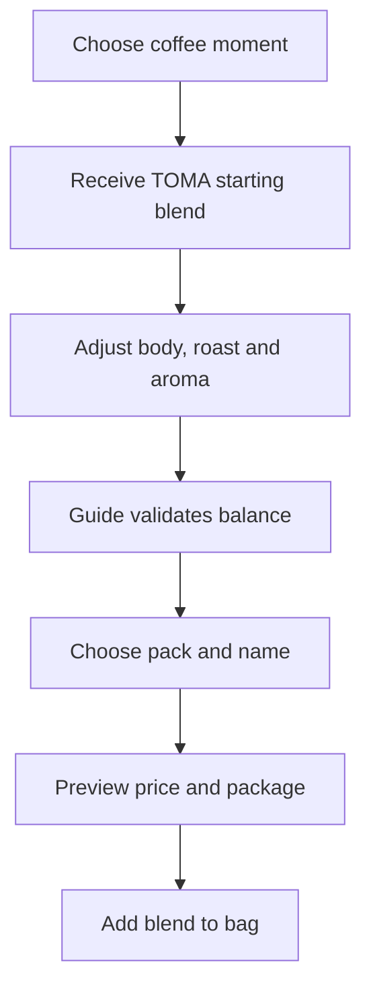

# TOMA Blend Builder — Product, UX and Design Specification

## 1. What this page is for

**TOMA Blend Lab** is the store page where a customer creates a coffee product around a real moment and a real taste preference. It is TOMA's differentiator: people can buy an approved ready-made coffee, or start from one and make a guided blend that is theirs.

The page must feel like an expert is standing beside the customer. It must **not** feel like an unrestricted recipe form, a medical recommendation engine, or a game.

**Core promise**

> Your cup. Your signature. Guided by TOMA.

**Primary conversion**: Add a valid custom blend to the bag.

**Secondary conversions**: buy the recommended ready-made product, save a blend for later, or share a blend link.

**Trust reason**: TOMA's approximately 12 years of coffee experience becomes visible through clear choices, controlled ranges, explanations, and blends that remain balanced.

---

## 2. Product principles

1. **Start with purpose, not ingredients.** A person should not need to know origins, roast science, or ratios before getting a useful first result.
2. **Freedom inside expertise.** The customer chooses direction; TOMA defines what can be combined and in what range.
3. **Every choice must show an effect.** A slider, ingredient, or format selection changes the visible cup, recipe summary, flavor profile, recommendation, and price state.
4. **Explain instead of blocking.** When a selection is discouraged, state why and offer the closest viable alternative.
5. **Keep product truth intact.** Only show coffee formats, ingredients, pack sizes, prices, stock status, and nutrition/caffeine values that TOMA has approved. Do not invent health, energy, or medical claims.

---

## 3. User journey



### The six starting moments

| Customer says | TOMA should optimize for | Default message |
|---|---|---|
| Start my day | Familiarity and a dependable first cup | “Start clear, then make it yours.” |
| Work or a long session | A fuller routine without vague performance promises | “Build presence before adding complexity.” |
| After lunch | A cleaner, easier finish | “Let aroma lead; keep the cup light on its feet.” |
| Gathering | An approachable profile for more than one person | “A balanced cup travels well around a table.” |
| Quiet ritual | Aroma, texture, and a slower sensory experience | “Protect the finish and give character room.” |
| Discover a new taste | Safe exploration with a clear comparison | “Change one thing at a time so you can learn your taste.” |

These moments guide taste and ritual only. They must never be presented as medical, productivity, stamina, or health outcomes.

---

## 4. Page structure and role of each section

| Area | Job | What the customer sees | Key interaction |
|---|---|---|---|
| Compact store header | Keep the user inside shopping, not a separate app | TOMA bean mark + `toma`, Shop, Bag, Help | Bag remains visible and updates live |
| Builder intro | Establish trust and orient the user | `TOMA Blend Lab` / `Your cup. Your signature.` / 12-year expertise line | `Start with a moment` scrolls to step 1 |
| Step progress | Reduce anxiety and preserve place | 01 Moment / 02 Coffee / 03 Character / 04 Pack | Completed steps can be revisited |
| Moment selector | Give the user a useful starting point | Six editorial cards with a short ritual description | Selecting a card loads a starter blend and guide insight |
| Base coffee | Establish the product's identity | Available format, current TOMA coffee base, grind when relevant | Options appear only if live in the catalog |
| Character controls | Let the customer shape taste safely | Body, roast, aroma/additions controls | Cup and profile update continuously |
| TOMA Guide | Make expertise concrete | Recommendation, effect explanation, preferred range, alternative | Warns softly and blocks only invalid recipes |
| Live blend visual | Turn invisible flavor changes into a sensory product | Coffee surface, steam, 5–6 beans, measured ingredient motion, bag label | Motion reacts once per meaningful change, never loops noisily |
| Pack and identity | Convert a recipe into a product worth buying | Pack size, optional blend name, package preview | Price and delivery eligibility update |
| Sticky order summary | Keep conversion visible | Blend name, ingredients, price, lead time, Add to bag | Validates, adds to bag, confirms next action |
| Post-add confirmation | Preserve momentum | “Your blend is in the bag” + save/share/reorder options | Go to bag or keep exploring |

---

## 5. Desktop design: one focused workbench

Use a 12-column, wide desktop layout with a sticky top bar. The workbench begins immediately after the intro.

| Column | Design content |
|---:|---|
| 1–3 | **Control rail** — current step, selected moment, buttons and sliders. Warm parchment background, thin brass dividers, no generic form boxes. |
| 4–8 | **The Cup / Product stage** — large top-down Turkish coffee cup with a white crema circle, restrained rising steam, an open TOMA bag/tray in the back, only 5–6 large coffee beans. Ingredient motion lands into the cup or bag once after a selection. |
| 9–12 | **TOMA Guide and order card** — dark espresso panel, brass rule, clear expert language, flavor profile bars, live price and Add to bag. Stays visible while the user adjusts the blend. |

### Visual hierarchy

1. The customer sees a beautiful cup and a clear question first.
2. The user makes one decision at a time.
3. The visual and guide react immediately.
4. The price and Add to bag are always within reach once the blend is valid.

### Style direction

- **Mood:** classic coffee heritage translated into a polished product-design tool.
- **Palette:** deep espresso `#1D120E`, roasted brown `#5A321E`, parchment `#EEE2CC`, warm cream `#FAF5EB`, charcoal `#151515`, muted brass `#B8894A`, restrained leaf green only for approved ingredient states.
- **Typography:** editorial serif headline such as Playfair Display or Cormorant; practical sans for controls such as Manrope/Inter; mono or small caps for recipe codes and measurements.
- **Surfaces:** parchment paper, soft grain, subtle shadow; no glassmorphism, neon gradient, excessive rounded cards, or rustic café clichés.
- **Logo:** use the supplied TOMA bean mark without a background, followed by the word `toma` in the selected editorial wordmark treatment. Use it on the package preview and top header; do not regenerate or distort the logo.

### Motion rules

- Steam: 6–8 second low-opacity vertical drift.
- Beans: only 5–6 large beans, a 450–650ms fall with gentle ease-out when the base changes.
- Addition: a small, contextual movement (for example cardamom pods/particles) only when the addition is confirmed.
- Profile and price: 180–250ms transitions.
- Respect `prefers-reduced-motion`; show the final visual state without motion.

---

## 6. Mobile design

Mobile must be a guided vertical path, not a squeezed three-column desktop page.

1. Fixed header with logo, `Bag (n)`, and close/back control.
2. A small horizontal step indicator below the header.
3. Moment cards become a two-column grid.
4. The live cup stage appears after each meaningful selection, with a collapsed “Recipe & TOMA Guide” drawer beneath it.
5. Controls are full-width and use clear option chips or bottom sheets; avoid tiny sliders where a 3-choice segmented control is clearer.
6. A fixed bottom bar shows current price or `Complete your blend`, then opens the order summary sheet.
7. The final mobile page has a product card, pack preview, and a full-width `Add my blend to bag` button.

---

## 7. The exact builder flow

### Step 1 — Choose the moment

**Question:** `What are you making coffee for today?`

The user chooses one of the six approved moments. TOMA immediately presents:

- a starting profile;
- a recommended ready-made product when one exists;
- an expert explanation in one sentence;
- two paths: `Keep this starting point` or `Make it mine`.

Example:

> **Quiet ritual**
> Start with a medium roast and balanced body. It keeps the aroma present without making the finish heavy.

### Step 2 — Choose the coffee base

**Question:** `How do you want this coffee to show up in your cup?`

Only show real, available TOMA formats. Initial configuration can support:

- Turkish coffee;
- espresso;
- filter;
- any additional approved formats.

Each format determines available grind options, recipe rules, price base, and the visual cup state.

### Step 3 — Shape character

Start with three understandable controls:

| Control | Customer labels | What changes live |
|---|---|---|
| Body & strength | Light / Balanced / Full | body profile, coffee color/depth, guide advice |
| Roast direction | Light / Medium / Dark | roast bar, cup tone, tasting notes |
| Aromatic addition | Plain / measured approved additions | aroma bar, small ingredient animation, recipe list |

Do not expose every percentage by default. Offer `Fine tune` only to a customer who deliberately opens it.

#### Fine-tune rule

If percentage control is allowed, show three states beneath it:

- **TOMA recommended range** — owner-approved band.
- **Your current amount** — precise selected value.
- **Maximum balanced amount** — hard limit from the expert configuration.

All ranges, labels, and caps must come from TOMA's approved recipe configuration; never hard-code invented recipe values in production.

### Step 4 — Turn it into a product

**Question:** `Make this blend yours.`

- Pack size: 50g / 100g / 250g / 500g, only when actually available.
- Optional blend name: 2–24 characters, for example `Zack's Morning Blend`.
- Optional label line: selected goal or tasting direction, not unverified claims.
- Package preview uses the real TOMA bean mark and the typed blend name.
- Price is calculated from the real SKU, approved ingredients, pack size, and any custom-blend fee.

### Step 5 — Review and buy

The summary must say exactly what is being sold:

- Blend name and pack size
- Coffee format / body / roast
- Approved additions and measured amounts
- Price and currency
- Stock or preparation lead time
- Delivery eligibility
- `Add my blend to bag`

Use `[CUSTOM BLEND BASE PRICE]`, `[CURRENCY]`, `[PREPARATION TIME]`, and `[DELIVERY RULE]` until TOMA confirms them. The known Turbo Mode product price ($5 for 50g) must not be reused as a custom blend price unless the owner approves it.

---

## 8. TOMA Guide: recommendation logic and language

The Guide is the heart of the experience. It is rule-based at launch; an AI assistant may be added later, but must not make unapproved recipe or health recommendations.

### Guide output structure

1. **What changed:** `You moved from balanced to full body.`
2. **What it means:** `The cup will feel denser and stay present longer after the first sip.`
3. **TOMA recommendation:** `Keep roast at medium if you want the coffee character to stay clear.`
4. **Safe next action:** `Try a light aromatic addition` or `Keep this starting point`.

### Example messages

| Condition | TOMA Guide response |
|---|---|
| Strong body + dark roast | `This will create a heavy, intense cup. Keep aroma restrained so the finish stays readable.` |
| Customer raises an approved addition near the cap | `You are near TOMA's maximum balanced amount. Going further would cover the coffee rather than support it.` |
| Addition unavailable for selected format | `This addition is not prepared for this format yet. Choose [approved alternative] or keep the coffee plain.` |
| First-time visitor changes many variables | `You changed three directions at once. Save this profile, or return one choice to learn what changed the cup.` |

### Non-negotiable guardrails

- No claims about energy, focus, stamina, treatment, weight, or health benefits.
- No “AI says” authority language. The customer sees `TOMA Guide`, grounded in owner-approved rules.
- No ingredient is selectable unless it is available, legal for the market, compatible with the format, and in stock.
- An invalid blend cannot enter the bag, but the UI must explain the route to a valid one.

---

## 9. Live data model and configuration

The builder must be driven by configuration, not UI hard-coding. The owner or admin should be able to create rules without a frontend release.

```ts
type BlendRule = {
  id: string;
  market: 'EG' | 'US' | string;
  formatId: string;
  ingredientId?: string;
  allowed: boolean;
  minPercent?: number;
  recommendedMinPercent?: number;
  recommendedMaxPercent?: number;
  maxPercent?: number;
  incompatibleWith?: string[];
  guideMessages: {
    default: string;
    nearMax?: string;
    incompatible?: string;
  };
};

type BlendDraft = {
  goalId: string;
  formatId: string;
  baseCoffeeSku: string;
  body: 'light' | 'balanced' | 'full';
  roast: 'light' | 'medium' | 'dark';
  additions: Array<{ ingredientId: string; percent?: number }>;
  grindId?: string;
  packSizeGrams: number;
  blendName?: string;
};
```

### Required APIs / services

| Need | Endpoint or service |
|---|---|
| Available bases and formats | `GET /catalog/blendable-products?market=` |
| Goals and starter blends | `GET /blend-goals` |
| Rules and compatibility | `GET /blend-rules?format=&market=` |
| Recalculate profile and price | `POST /blend/quote` |
| Add draft to cart | `POST /cart/items` |
| Save/reorder a blend | `POST /me/blends` and `POST /me/blends/:id/reorder` |
| Inventory / market validation | performed again server-side when quoting and adding to cart |

The browser may give instant feedback, but the server is the final authority on recipe validity, price, inventory, and market availability.

---

## 10. Flavor profile and pricing

### Profile shown to the customer

Use simple scales with plain labels, not pseudo-scientific numbers:

- Body
- Roast
- Aroma
- Bitterness
- Sweetness / roundness, only if TOMA can define it honestly

Avoid caffeine levels until laboratory or product data supports exact values.

### Pricing formula

```text
final price = approved base SKU price
            + pack-size adjustment
            + approved additions cost
            + custom blending / packaging fee (if applicable)
            - valid promotion
```

Show a single transparent line beneath the total only if the business wants to expose it, for example: `Custom blending included` or `Price changes with pack size and approved additions.` Never simulate a discount or a crossed-out “was” price without a real promotion.

---

## 11. Visual and media plan

| Visual | Classification | Purpose |
|---|---|---|
| TOMA bean mark | **[SUPPLIED ASSET]** | Header, package preview, confirmed order state |
| `toma` wordmark treatment | **[DESIGNED TYPE TREATMENT]** | Paired with bean mark; do not fake a different logo |
| Turbo Mode package / approved product packs | **[REAL PRODUCT IMAGE REQUIRED]** | Ready-product alternatives and approved starter blends |
| Top-down coffee cup with crema / steam | **[AI-GENERATED IMAGE]** or high-end product render | Live product stage; should support color-state overlays |
| Open bag and brass serving tray | **[AI-GENERATED IMAGE]** or controlled product shoot | Background stage, not a generic café scene |
| 5–6 large coffee beans | **[AI-GENERATED IMAGE]** / CSS motion assets | Selective motion only |
| Ingredients (cardamom or other approved additions) | **[REAL PRODUCT IMAGE REQUIRED]** where commercial accuracy matters; otherwise **[OPTIONAL GENERATED MOCKUP]** for early concept | Ingredient card and small motion state |
| Founder portrait | **[REAL BRAND / FOUNDER IMAGE REQUIRED]** | Optional reassurance panel; never use a generated substitute as the real founder |

---

## 12. MVP versus later phases

### MVP — build first

- Six goal cards
- One or more owner-approved starter blends
- Turkish coffee first, then only formats confirmed in catalog
- Body, roast, and one approved aromatic-addition control
- Rule-based TOMA Guide
- Live cup/profile/package preview
- Pack size, name, quote, add to bag
- Admin-configured rules with server-side validation

### Phase 2

- Saved blend account library and reorder
- Shareable blend card/link
- More formats and ingredients after owner approval
- Product comparison: custom blend vs ready-made TOMA SKU
- Subscription / repeat schedule if operations support it
- Conversational helper that is constrained to the exact approved rule set

### Do not add in V1

- A free-text “make anything” recipe box
- Medical/energy recommendations
- An unbounded AI recipe generator
- Public blend marketplace
- Complex origin-percentage mixing unless TOMA can consistently source and fulfil it

---

## 13. Measurement and acceptance criteria

### Key product events

- `blend_builder_opened`
- `goal_selected`
- `starter_blend_loaded`
- `blend_attribute_changed`
- `guide_warning_shown`
- `pack_size_selected`
- `blend_quote_viewed`
- `custom_blend_added_to_bag`
- `custom_blend_order_completed`

### First-release success signals

- At least 70% of visitors who choose a goal reach a valid product summary.
- At least 30% of builder users add either a starter product or a custom blend to bag.
- Most invalid selections are resolved by the suggested alternative without leaving the page.
- Support messages about “what did I order?” decrease because the recipe summary is explicit.

### QA checklist

- Every market only receives its valid catalog, price, ingredients, and shipping state.
- Mobile fixed CTA never hides a required control.
- Price cannot be changed from the browser before checkout.
- Changing format revalidates every prior selection.
- Back navigation preserves the draft.
- Reduced-motion setting removes visual animations.
- Empty stock and unavailable combinations have human, actionable explanations.

---

## 14. Design prompt — high-fidelity UI concept

Use the following prompt with an image/UI generation tool or as the brief for a designer. Attach the supplied TOMA bean-mark logo as a reference asset.

```text
Create a high-fidelity desktop ecommerce product-customization page for TOMA Coffee called “TOMA Blend Lab”.

Brand: TOMA is an Egyptian premium coffee brand with around 12 years of coffee experience. Its differentiator is guided personalization: customers can create a coffee blend around their taste and coffee moment, while expert rules protect balance and quality. The brand must feel like classic coffee heritage translated into a modern premium digital product. It is not a generic café template, rustic craft page, flashy startup, or health-product ad.

Layout: wide 1440px desktop page, minimal store header. Use a 12-column workbench. Left 3 columns: a parchment-toned control rail with step progress “01 Moment / 02 Coffee / 03 Character / 04 Pack”, six purpose cards, elegant selection controls for body and roast, and one approved aromatic addition. Centre 5 columns: an atmospheric product stage with a top-down Turkish coffee cup, crisp white crema circle, subtle rising steam, an open black TOMA coffee bag on a premium brass serving tray, and exactly 5 or 6 large coffee beans suspended naturally in motion — no bean rain. The bag should carry the supplied TOMA bean mark without background followed by a refined ‘toma’ wordmark; include a clean blend label area. Right 4 columns: a deep espresso “TOMA Guide” panel with short expert recommendations, profile bars for body/aroma/roast, a clear price area using [CUSTOM BLEND BASE PRICE], and a brass Add my blend to bag button.

Content hierarchy: headline “Your cup. Your signature.” subline “Guided by TOMA.” small proof line “Built on around 12 years in coffee.” Main question: “What are you making coffee for today?” Six cards: Start my day, Work or a long session, After lunch, Gathering, Quiet ritual, Discover a new taste. The selected card shows a starting blend recommendation. Show the flavor effect in plain language, not medical claims. Include “TOMA recommended range” and “Maximum balanced amount” as restrained information labels. Show a package preview with a blend name field: “Your Name’s Blend”.

Visual system: deep espresso brown #1D120E, roasted coffee #5A321E, warm cream #FAF5EB, parchment #EEE2CC, charcoal #151515, muted brass #B8894A. Editorial serif headline typography, disciplined modern sans-serif controls, fine brass divider lines, light grain texture, high contrast but warm lighting. Premium, calm, sensory, magazine-quality composition. No gradients, neon, glassmorphism, fake awards, fake reviews, excessive rounded cards, health claims, or made-up countries/statistics. The page should look like a real premium store interface ready for conversion, not a dashboard.
```

---

## 15. Implementation prompt — for a coding agent

```text
Build a production-quality “TOMA Blend Lab” route for the existing TOMA Coffee ecommerce site. Preserve the existing TOMA visual identity: deep espresso, parchment, warm cream, muted brass, editorial typography, supplied bean-mark logo with no background plus the word “toma”. The page must be responsive and accessible.

Goal: let a customer create a valid custom coffee product through guided choices, not an unrestricted ingredient form. Implement goal → starter blend → customize → TOMA Guide → pack/name → server-validated quote → add to cart.

Requirements:
1. Create a desktop 12-column workbench: left control rail, center live coffee/product visual, right sticky TOMA Guide/order summary. Convert it to a single-column guided mobile flow with a fixed bottom CTA.
2. Implement the six goal cards: Start my day, Work or a long session, After lunch, Gathering, Quiet ritual, Discover a new taste. Each goal loads a configuration-driven starter blend and one concise TOMA Guide message. Never make medical, stamina, focus, or health claims.
3. Start V1 controls with body (light/balanced/full), roast (light/medium/dark), and approved aromatic additions. Support an optional fine-tune percentage only where configuration supplies a recommended range and a hard maximum.
4. Build a deterministic rules engine. The client should give instant feedback, but POST /blend/quote must be authoritative for availability, compatibility, recipe validity, price, market, inventory, and pack size. Invalid blends cannot be added to cart; show an explanation and an approved alternative.
5. Keep all recipes, ingredient availability, ranges, caps, guide copy, product IDs, prices, markets, and stock data in configuration/API responses. Do not hard-code invented recipe ratios, price values, health claims, or stock.
6. The live visual should include a Turkish coffee cup with white crema circle, subtle steam, an open branded bag/tray, and only 5–6 large beans. Animate a selection only once with a restrained 450–650ms motion. Honour prefers-reduced-motion.
7. Implement a live recipe summary: format, body, roast, additions, pack size, blend name, price, and preparation/delivery placeholders until real operational values exist. Known Turbo Mode data must remain separate from custom blend pricing unless config explicitly permits it.
8. Use semantic controls, keyboard navigation, labels, aria-live updates for guide/quote feedback, focus management for drawers, and visible error states.
9. Track: blend_builder_opened, goal_selected, starter_blend_loaded, blend_attribute_changed, guide_warning_shown, pack_size_selected, blend_quote_viewed, custom_blend_added_to_bag, custom_blend_order_completed.
10. Write unit tests for the rules engine, integration tests for quote/add-to-cart flows, and responsive UI tests for the mobile CTA and draft persistence.

Deliver components such as BlendBuilderPage, GoalSelector, BaseCoffeeStep, CharacterControls, TomaGuide, LiveBlendStage, PackCustomizer, BlendSummary, and a typed blend configuration/rules model. Do not use generic coffee copy, fake testimonials, fake awards, or placeholder images presented as real product assets.
```

---

## 16. Decisions TOMA must approve before development

1. Which coffee formats and base SKUs are actually blendable in each market?
2. Which ingredients are approved, in stock, legal, and compatible with each format?
3. What are the expert-approved recommended ranges and absolute limits for every addition?
4. What pack sizes are available for a custom blend, and what is the custom pricing formula?
5. Is a custom blend prepared on demand, and what is the real preparation/delivery promise?
6. Can anonymous visitors add a custom blend to cart, or must saving/reordering require an account?
7. Who owns the admin process that maintains recipe rules, prices, availability, and guide copy?

Until these are confirmed, design and build the experience using explicit configuration placeholders—not fictional data.
